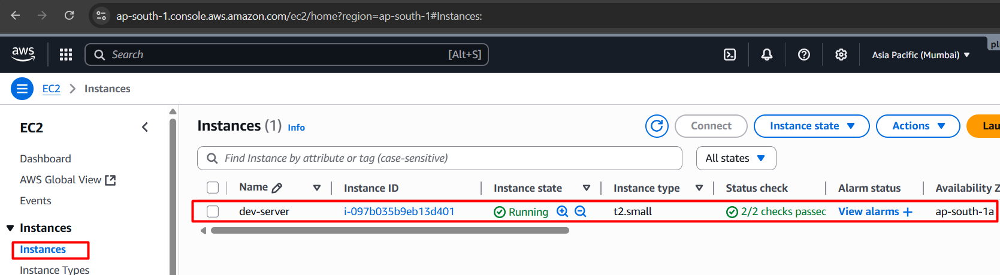
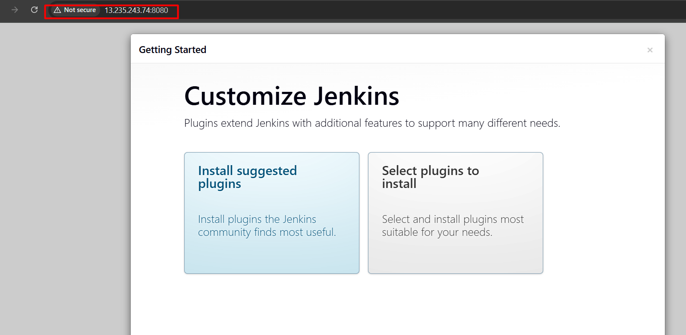
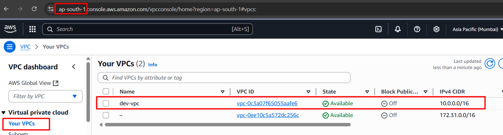
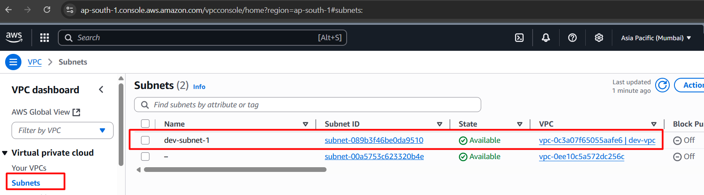
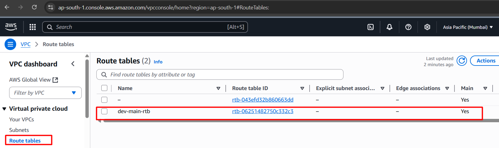
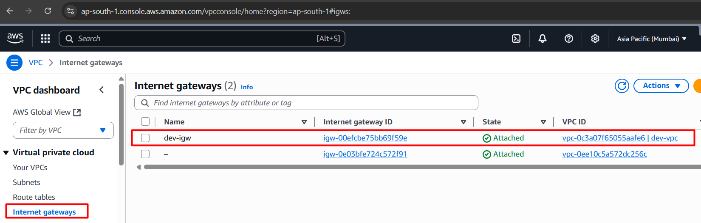
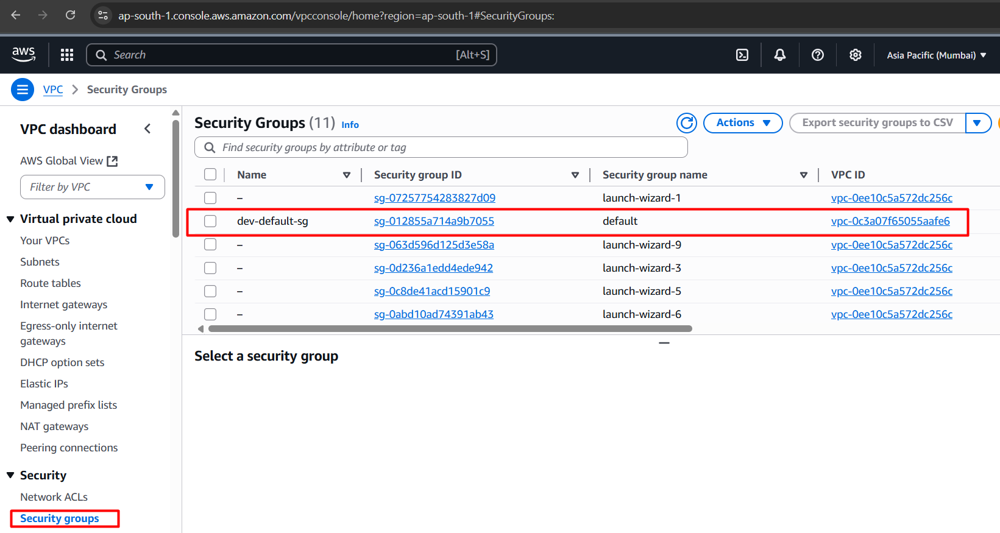

# Jenkins Server using Terraform

This project provisions a **Jenkins server** on AWS using **Terraform**.  
It creates the required infrastructure (VPC, subnets, security groups, EC2 instance) and installs Jenkins automatically via a startup script.

---

##  Project Structure

```
├── backend.tf              # Remote backend configuration for Terraform state
├── Jenkins-server.tf       # EC2 instance configuration for Jenkins
├── Jenkins-server-scripts.sh # Script to install & configure Jenkins on the server
├── output.tf               # Output values (e.g., Jenkins URL, Public IP)
├── provider.tf             # AWS provider configuration
├── terraform.tfvars        # Variables values file
├── tfplan                  # Terraform execution plan (optional / generated)
├── variable.tf             # Input variables definition
├── vpc.tf                  # VPC, subnets, and networking setup
└── .terraform.lock.hcl     # Provider dependency lock file
```

---

##  Prerequisites

- [Terraform](https://developer.hashicorp.com/terraform/downloads) installed  
- [AWS CLI](https://docs.aws.amazon.com/cli/latest/userguide/getting-started-install.html) installed and configured (`aws configure`)  
- An AWS account with permissions to create VPCs, EC2, Security Groups, etc.  

---

##  Setup Instructions

1. **Clone the Repository**
   ```bash
   git clone https://github.com/tribhuwanpandey/Infrastructure-as-Code/tree/main/Terraform/Jenkins-server-using-terraform
   cd Jenkins-server-using-terraform
   ```

2. **Initialize Terraform**
   ```bash
   terraform init
   ```

3. **Validate the Configuration**
   ```bash
   terraform validate
   ```

4. **Generate & Review the Plan**
   ```bash
   terraform plan -out=tfplan
   terraform show tfplan
   ```

5. **Apply the Configuration**
   ```bash
   terraform apply "tfplan"
   ```

6. **Access Jenkins**
   - Get the Jenkins server public IP:
     ```bash
     terraform output
     ```
   - Open in browser:
     ```
     http://13.235.243.74:8080
     ```

---

##  Notes

- The `Jenkins-server-scripts.sh` handles Jenkins installation. You can modify it to install plugins or configure Jenkins further.  
- To destroy the infrastructure:
  ```bash
  terraform destroy
  ```

---

##  Customization

- Update `terraform.tfvars` to set your own values (e.g., region, instance type).  
- Modify `variable.tf` to add new configurable variables.  
- Adjust `vpc.tf` if you want a custom networking setup.  

---

##  Outputs
 
Ec2



Jenkins-url



VPC



Subnet



Route-Table



Internet-Gatway



Security-Group

