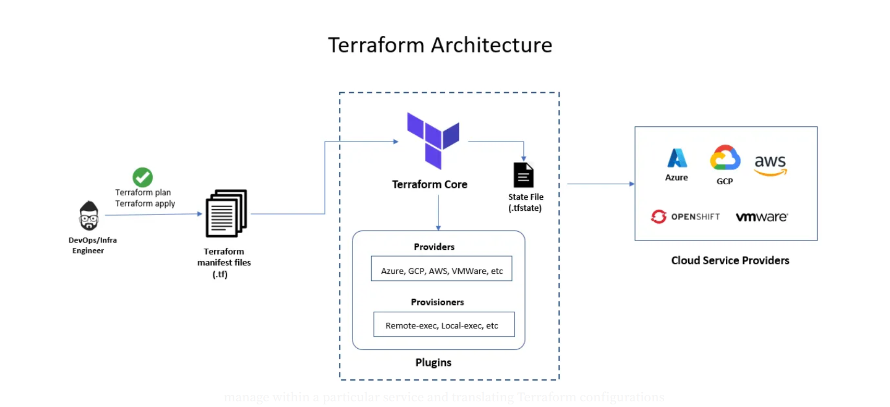

# Introduction to Terraform

## What is Terraform?

Terraform is an **open-source Infrastructure as Code (IaC)** tool created by HashiCorp that allows you to **define, provision, and manage infrastructure** across various cloud providers and services using a simple, declarative configuration language.

- Uses **HashiCorp Configuration Language (HCL)**, which is human-readable and easy to learn.
- Supports **multi-cloud** and hybrid-cloud environments (AWS, Azure, GCP, Kubernetes, etc.).
- Automates the entire infrastructure lifecycle: creation, updates, and destruction using **declarative configurations**.

---

## Infrastructure as Code (IaC) and Terraform

IaC is the practice of managing infrastructure (servers, storage, networks) through code instead of manual configuration.

Terraform enables IaC by allowing you to:

- Define infrastructure components as code.
- Version control infrastructure configurations.
- Automate infrastructure deployment and management.
- Ensure consistency across environments.
- Enable repeatable, reliable infrastructure changes.

---

## Use Cases of Terraform

1. **Provisioning Cloud Infrastructure**  
   Automate setup of virtual machines, networking, databases on AWS, Azure, GCP, etc.

2. **Multi-Cloud Management**  
   Manage resources across multiple cloud providers with one tool.

3. **Hybrid Cloud Environments**  
   Provision resources on-premises and in the cloud.

4. **Infrastructure Automation in CI/CD Pipelines**  
   Integrate provisioning into continuous delivery pipelines.

5. **Self-Service Infrastructure for Teams**  
   Allow teams to deploy infrastructure on-demand using predefined modules.

6. **Disaster Recovery**  
   Quickly recreate infrastructure from code in case of failure.

7. **Immutable Infrastructure**  
   Replace infrastructure instead of patching, reducing drift.

8. **Kubernetes Infrastructure**  
   Manage Kubernetes clusters and resources declaratively.

---

## How Does Terraform Work?

1. **Write Configuration**  
   Define resources in `.tf` files using HCL (e.g., EC2 instances, S3 buckets).

2. **Initialize Terraform**  
   `terraform init` downloads necessary provider plugins.

3. **Plan Changes**  
   `terraform plan` creates an execution plan showing actions Terraform will perform.

4. **Apply Changes**  
   `terraform apply` provisions or modifies infrastructure as specified.

5. **Maintain State**  
   Terraform keeps a **state file** mapping configurations to real resources.

6. **Destroy Infrastructure**  
   `terraform destroy` removes managed infrastructure when needed.

---

## Advantages of Terraform

- **Cloud Agnostic:** Supports many providers (AWS, Azure, GCP, VMware, Kubernetes, etc.).
- **Declarative Language:** Describe desired infrastructure without scripting how.
- **State Management:** Tracks resource states for incremental changes.
- **Modular & Reusable:** Supports modules for reusable components.
- **Strong Ecosystem:** Large community and plugin ecosystem.
- **Automation Friendly:** Integrates with CI/CD pipelines.
- **Plan Command:** Preview changes before applying.
- **Extensible:** Custom providers and plugins can be created.

---

## Disadvantages of Terraform

- **State File Management:** Requires secure and collaborative state file handling.
- **Learning Curve:** Mastering complex architectures takes time.
- **Imperative Edge Cases:** Some complex configurations need workarounds.
- **Debugging:** Errors can be unclear.
- **Provider Limitations:** Providers may lag behind cloud APIs.
- **No Native Configuration Management:** Manages infrastructure, but not software inside instances.

---

## Terraform vs Other Infrastructure as Code Tools

| Feature               | Terraform                            | AWS CloudFormation                  | Ansible                             | Chef/Puppet                        |
|-----------------------|------------------------------------|-----------------------------------|-----------------------------------|----------------------------------|
| **Type**              | Declarative                        | Declarative                      | Imperative                        | Imperative                      |
| **Cloud Support**      | Multi-cloud and on-premises       | AWS only                        | Multi-cloud (config management)  | Multi-cloud (config management)  |
| **Language**           | HCL (declarative)                 | JSON/YAML (declarative)          | YAML (imperative playbooks)       | Ruby DSL (imperative)             |
| **State Management**   | Maintains state file               | Manages state internally          | No state management               | No state management              |
| **Configuration vs Provisioning** | Infrastructure provisioning | Infrastructure provisioning       | Configuration management          | Configuration management         |
| **Community & Ecosystem** | Large and growing                | AWS ecosystem                    | Large for configuration           | Large for configuration          |
| **Use Case Focus**     | Provisioning & orchestrating resources | AWS resource management           | Software configuration & automation | Software configuration & automation |
| **Modularization**     | Supports modules                  | Nested stacks                    | Roles & playbooks                  | Cookbooks                       |
| **Learning Curve**     | Moderate                        | Easy if only AWS                  | Moderate                        | Steep                          |

---

## Summary

Terraform is a powerful, cloud-agnostic IaC tool widely used for provisioning and managing infrastructure declaratively. It excels in multi-cloud support, modularity, and automation integration. While state management and complexity can be challenging, Terraform’s benefits make it a popular choice for DevOps teams worldwide.

---

